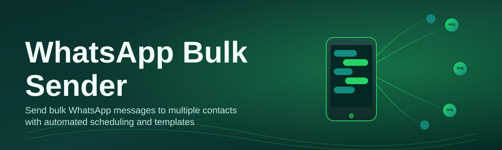
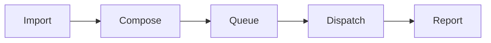

# whatsapp-bulk-sender-tool 📲🚀

  

*One list, one click, one thousand conversations started — bulk WhatsApp messaging that doesn't fight you.*

  

---

## 🧭 Overview

I built the first version of this tool at 1 AM because I was manually copy-pasting the same delivery update into WhatsApp for 340 customers, one contact at a time, like some kind of digital scribe from the 1400s. Somewhere around contact #90 I closed the laptop, opened a text editor, and decided that no human being should ever have to do that again. That grudge became `whatsapp-bulk-sender-tool` — a desktop utility for Windows that turns a spreadsheet of phone numbers into a fully personalized, rate-aware WhatsApp campaign without you touching "send" more than once.

This is not a marketing suite pretending to understand WhatsApp. It's a focused **WhatsApp bulk sender** built around the actual mechanics of messaging at scale: contact list management, per-message templating, attachment handling, delivery pacing, and a session that survives a bad Wi-Fi day. Whether you're a small business running order confirmations, a community organizer sending event reminders, or a support team pushing status updates, the tool is built to handle the boring, repetitive, and error-prone parts so you can focus on what you're actually saying.

Under the hood it's a lightweight, standalone Windows application — no background services, no hidden agents, no subscription dashboard phoning home. You install it, you point it at your list, you write your message once, and it does the multiplying. That's the whole pitch, and we've tried very hard to keep it that simple even as the feature list grew.

---

## ⚡ What It Actually Does

  

- **Contact List Alchemy** — import CSV or XLSX files and the tool auto-detects phone number columns, strips formatting garbage, and flags duplicates before you ever hit send.

- **Template Variables That Feel Human** — drop in `{{first_name}}`, `{{order_id}}`, or any custom field, and every message reads like it was typed individually, because functionally it was.

- **Smart Send Throttling** — configurable delay windows between messages so your outreach behaves like a person texting, not a script hammering a server.

- **Media & Attachment Support** — images, PDFs, voice notes, whatever the campaign needs, attached once and distributed to the whole list.

- **Failed-Send Recovery** — if a number bounces, is invalid, or the app hiccups mid-run, it logs the failure and lets you retry just that subset instead of restarting the entire batch.

- **Campaign History Log** — every batch you've ever sent, with timestamps, success counts, and export-to-CSV for your own records.

- **Multi-Session Profiles** — keep separate contact lists and message templates for different campaigns without them bleeding into each other.

- **Local-First Data Handling** — your contact lists and message history stay on your machine, not on someone else's server.

> [!TIP]
> Start with a test batch of 5-10 contacts before running a full send. It catches formatting mistakes in your template before they reach 2,000 people.

---

## 🚀 Getting Off The Ground

1. **Visit the landing page** using the download button above — that's the only place this build lives.

2. **Download the installer** for Windows 10/11 and run it. No terminal, no package manager, no drama.

3. **Import your contact list**, write your message template, attach media if needed, and set your send delay.

4. **Launch the campaign**, watch the live progress log, and grab a coffee — the tool paces itself so you don't have to babysit it.

> [!NOTE]
> First launch may take a few extra seconds while the app initializes its local session store. This is normal and only happens once.

---

## 🖥️ System Requirements

| Component | Minimum | Recommended |
|---|---|---|
| **OS** | Windows 10 (64-bit) | Windows 11 (64-bit) |
| **RAM** | 4 GB | 8 GB or more |
| **Disk Space** | 250 MB free | 1 GB free (for logs & media cache) |
| **Display** | 1280x720 | 1920x1080 |
| **Dependencies** | None — fully standalone | None — fully standalone |

> [!IMPORTANT]
> This tool is a native standalone Windows application. It does not require Python, Node, or any runtime to be pre-installed on your machine.

---

## 🛠️ How It Works

The architecture is deliberately boring — boring is stable, and stable is the whole point of an enterprise-grade **bulk WhatsApp sender**.

1. **Import** — your contact list is parsed and validated locally.

2. **Compose** — you write one template; variables get resolved per-contact at send time.

3. **Queue** — the send engine builds an ordered queue with your configured delay between entries.

4. **Dispatch** — messages go out one at a time through your active WhatsApp Web session.

5. **Report** — successes, failures, and retries are written to the campaign log.

> [!WARNING]
> Sending extremely large batches (10,000+) in a single session may trigger WhatsApp's own anti-spam throttling. Split large campaigns into smaller windows for reliable delivery.

---

## 🩹 Troubleshooting

<strong>My messages are sending but images aren't attaching.</strong>

 

Check that the attached file is under the size limit set in Settings → Media, and confirm the file path doesn't contain special characters that some systems mishandle.

<strong>The app says "session expired" mid-campaign.</strong>

 

Your WhatsApp Web session timed out. Re-scan the QR pairing screen and resume — the tool remembers where it left off in the queue.

<strong>Some numbers in my CSV are being skipped.</strong>

 

The validator skips rows missing a country code or containing non-numeric characters. Run the built-in "Clean List" tool before importing to auto-fix most of these.

<strong>Is there a limit on how many contacts I can load?</strong>

 

No hard cap in the app itself, but we recommend batching above 5,000 contacts to keep delivery pacing reliable and reduce throttling risk.

<strong>Can I schedule a campaign for later instead of sending now?</strong>

 

Yes — the Scheduler tab lets you set a future date and time, and the app will launch the queue automatically if it's running in the background.

---

## 🎨 UI, UX & Little Details That Matter

> [!TIP]
> Press `Ctrl + N` to start a new campaign, `Ctrl + S` to save your current template, and `F5` to refresh delivery status without restarting the send.

- **Light & Dark themes**, switchable from Settings → Appearance, with the dark theme genuinely designed for late-night send sessions (see: our origin story above).

- **Live progress bar** with per-contact status ticks — sent, pending, failed — color-coded so a glance tells you everything.

- **Draggable panel layout** — rearrange the contact list, preview pane, and log panel to match how you actually work.

- **Keyboard-first navigation** for power users running frequent campaigns without reaching for the mouse.

- **Adjustable send-delay slider** with presets for "cautious," "standard," and "aggressive" pacing.

---

## 🤝 Contributing & Community

We welcome issues, feature requests, and pull requests — this project grew because people who were annoyed by the same manual-messaging grind kept showing up to fix it properly.

- Open an issue for bugs or feature ideas.

- Fork the repo, branch off, and submit a PR with a clear description of what changed and why.

- Join discussions in the repository's Discussions tab to shape the roadmap for future WhatsApp bulk sender releases.

> Every contribution, no matter how small, gets reviewed and credited. We built this together at 1 AM out of frustration — it stays open because of the same spirit.

---

## 📄 License

Released under the [MIT License](LICENSE), 2026. Use it, modify it, ship it inside your own workflow — just keep the attribution intact.

---

## ⚠️ Disclaimer

This tool is an independent, third-party utility and is **not affiliated with, endorsed by, or sponsored by WhatsApp or Meta Platforms, Inc.** WhatsApp is a trademark of Meta Platforms, Inc. Users are responsible for ensuring their messaging campaigns comply with WhatsApp's Terms of Service and applicable anti-spam and data privacy regulations in their jurisdiction. Use responsibly.

